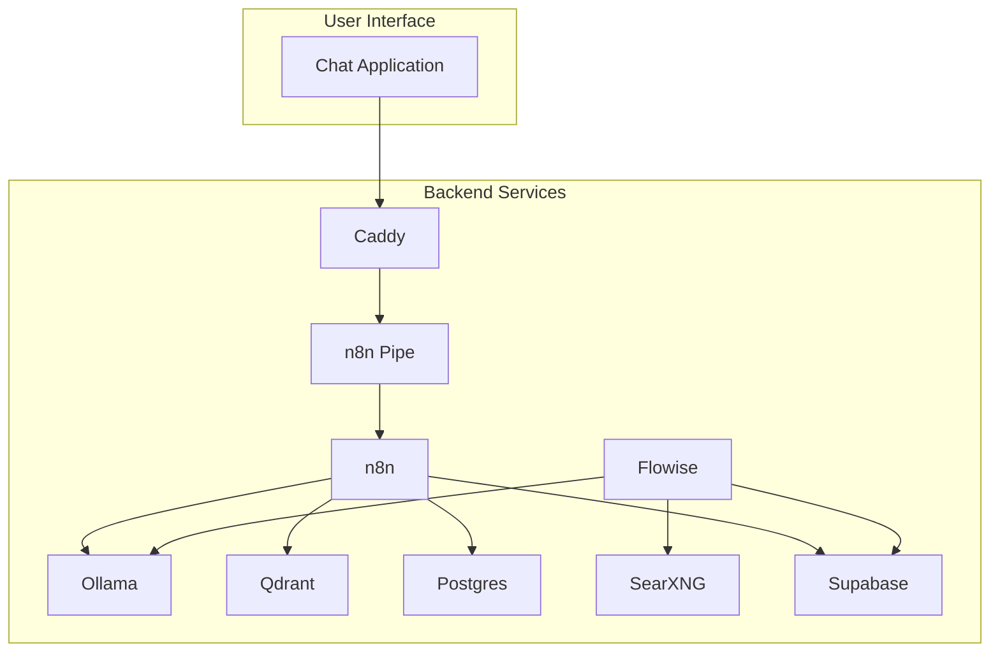

# Technical README

This document provides a technical overview of the project, its architecture, and its components. It is intended for developers who want to understand how the system works and how to contribute to it.

## Table of Contents

- [Architecture](#architecture)
- [Services](#services)
- [Workflows](#workflows)
- [Scripts](#scripts)
- [Getting Started](#getting-started)

## Architecture

This project implements a sophisticated Retrieval-Augmented Generation (RAG) AI agent using a microservices architecture. The entire system is orchestrated using Docker Compose, which makes it easy to set up and run on any machine with Docker installed.

The architecture is designed to be modular and extensible. The core components are:

*   **n8n**: A workflow automation tool that is used to create and manage the RAG pipeline.
*   **Flowise**: A low-code platform for building LLM applications, used here to create a "Tool Agent" that can interact with various tools.
*   **Ollama**: A service for running large language models locally.
*   **Qdrant**: A vector database for storing and searching text embeddings.
*   **Postgres**: A relational database for storing chat history and other application data.
*   **SearXNG**: A meta-search engine for providing privacy-respecting web search results.
*   **Supabase**: An open-source Firebase alternative that provides a suite of tools for building applications, including a database, authentication, and storage.
*   **Caddy**: A modern, easy-to-use web server that acts as a reverse proxy for all the services.

The following diagram illustrates the high-level architecture of the system:



## Services

This section provides a detailed explanation of each service in the system.

### n8n

*   **Purpose**: n8n is a workflow automation tool that is used to create and manage the RAG pipeline. It is the core of the AI agent, responsible for orchestrating the flow of data between the different services.
*   **Configuration**: The n8n service is configured in the `docker-compose.yml` file. The workflows are stored in the `n8n/backup/workflows` directory.
*   **Usage**: The n8n workflows are triggered by webhooks from the chat application. They are responsible for creating the knowledge base, processing user queries, and generating responses.

### Flowise

*   **Purpose**: Flowise is a low-code platform for building LLM applications. It is used here to create a "Tool Agent" that can interact with various tools, such as web search and custom tools for interacting with Google Docs, Postgres, and Slack.
*   **Configuration**: The Flowise service is configured in the `docker-compose.yml` file. The chatflows are stored in the `flowise` directory.
*   **Usage**: The Flowise chatflows are used to provide the AI agent with additional capabilities beyond the basic RAG pipeline.

### Ollama

*   **Purpose**: Ollama is a service for running large language models locally. It is used to power the AI agent's chat and embedding models.
*   **Configuration**: The Ollama service is configured in the `docker-compose.yml` file. It supports different profiles for CPU and GPU, allowing you to run larger models on more powerful hardware.
*   **Usage**: The Ollama service is used by both n8n and Flowise to generate text and embeddings.

### Qdrant

*   **Purpose**: Qdrant is a vector database for storing and searching text embeddings. It is used to store the knowledge base for the RAG agent.
*   **Configuration**: The Qdrant service is configured in the `docker-compose.yml` file.
*   **Usage**: The Qdrant service is used by the n8n workflow to store and retrieve text embeddings.

### Postgres

*   **Purpose**: Postgres is a relational database for storing chat history and other application data.
*   **Configuration**: The Postgres service is configured in the `docker-compose.yml` file.
*   **Usage**: The Postgres service is used by the n8n workflow to store chat history, which is used to provide the AI agent with memory.

### SearXNG

*   **Purpose**: SearXNG is a meta-search engine for providing privacy-respecting web search results.
*   **Configuration**: The SearXNG service is configured in the `docker-compose.yml` file. The configuration file is located at `searxng/settings.yml`.
*   **Usage**: The SearXNG service is used by the Flowise agent to perform web searches.

### Supabase

*   **Purpose**: Supabase is an open-source Firebase alternative that provides a suite of tools for building applications, including a database, authentication, and storage.
*   **Configuration**: The Supabase service is configured in the `supabase/docker/docker-compose.yml` file.
*   **Usage**: Supabase is used for data storage and user management.

### Caddy

*   **Purpose**: Caddy is a modern, easy-to-use web server that acts as a reverse proxy for all the services.
*   **Configuration**: The Caddy service is configured in the `docker-compose.yml` file. The Caddyfile is located at the root of the project.
*   **Usage**: Caddy is used to expose the services to the outside world and to provide SSL termination.

## Workflows

This section describes the n8n and Flowise workflows that are included in this project.

### n8n Workflows

The n8n workflows are located in the `n8n/backup/workflows` directory. There are three workflows provided:

*   **`V1_Local_RAG_AI_Agent.json`**: This workflow implements a complete RAG system. It uses Google Drive as a source for its knowledge base, Ollama for language models and embeddings, Qdrant for the vector store, and Postgres for chat memory. The workflow can be triggered by a webhook or by changes to a Google Drive folder.
*   **`V2_Local_Supabase_RAG_AI_Agent.json`**: This workflow is similar to the V1 workflow, but it uses Supabase for storage instead of a local Postgres database.
*   **`V3_Local_Agentic_RAG_AI_Agent.json`**: This workflow is a more advanced version of the RAG agent that uses an agentic approach. It is not fully implemented yet.

### Flowise Workflows

The Flowise workflows are located in the `flowise` directory. The main workflow is `Web Search + n8n Agent Chatflow.json`. This chatflow defines a "Tool Agent" that can use several tools to answer user queries. The agent has access to the following tools:

*   **BraveSearch API**: For performing web searches.
*   **Custom Tools**: There are four custom tools, which are likely the other JSON files in the `flowise` directory:
    *   `create_google_doc-CustomTool.json`
    *   `get_postgres_tables-CustomTool.json`
    *   `send_slack_message_through_n8n-CustomTool.json`
    *   `summarize_slack_conversation-CustomTool.json`

## Scripts

This section describes the Python scripts that are included in this project.

### `n8n_pipe.py`

*   **Purpose**: This script acts as a bridge between a chat application and the n8n workflows. It defines a `Pipe` class that can be used to send messages to an n8n webhook and receive responses.
*   **Usage**: This script is intended to be used as a "pipe" in a larger chat application. It is not run directly.

### `start_services.py`

*   **Purpose**: This script is a utility for starting and stopping the entire stack of services. It automates the process of cloning the Supabase repository, preparing the environment, generating a secret key for SearXNG, and starting the Docker Compose services in the correct order.
*   **Usage**: This script is run from the command line to start the system. It accepts arguments for specifying the Docker Compose profile and environment.

## Getting Started

This section provides instructions on how to set up and run the system.

### Prerequisites

*   Docker
*   Docker Compose
*   Git
*   Python 3

### Installation

1.  **Clone the repository**:
    ```bash
    git clone https://github.com/your-username/your-repository.git
    cd your-repository
    ```
2.  **Create a `.env` file**:
    Create a `.env` file in the root of the project and add the following environment variables:
    ```
    POSTGRES_PASSWORD=your-postgres-password
    N8N_ENCRYPTION_KEY=your-n8n-encryption-key
    N8N_USER_MANAGEMENT_JWT_SECRET=your-n8n-jwt-secret
    FLOWISE_USERNAME=your-flowise-username
    FLOWISE_PASSWORD=your-flowise-password
    NEO4J_AUTH=neo4j/your-neo4j-password
    LETSENCRYPT_EMAIL=your-email@example.com
    LANGFUSE_SALT=your-langfuse-salt
    ENCRYPTION_KEY=your-encryption-key
    CLICKHOUSE_PASSWORD=your-clickhouse-password
    MINIO_ROOT_PASSWORD=your-minio-password
    NEXTAUTH_SECRET=your-nextauth-secret
    ```
3.  **Run the start script**:
    ```bash
    python3 start_services.py
    ```
    This will start all the services in the background. You can specify the profile and environment using the `--profile` and `--environment` arguments. For example:
    ```bash
    python3 start_services.py --profile gpu-nvidia --environment public
    ```

### Accessing the services

Once the services are running, you can access them at the following URLs:

*   **n8n**: `http://localhost:5678`
*   **Flowise**: `http://localhost:3001`
*   **Open WebUI**: `http://localhost:8080`
*   **Qdrant**: `http://localhost:6333`
*   **Neo4j**: `http://localhost:7474`
*   **Langfuse**: `http://localhost:3000`
*   **SearXNG**: `http://localhost:8081`
*   **Supabase**: `http://localhost:8000`

If you are using the `private` environment (the default), the services will only be accessible from your local machine. If you are using the `public` environment, the services will be exposed to the internet via Caddy.
