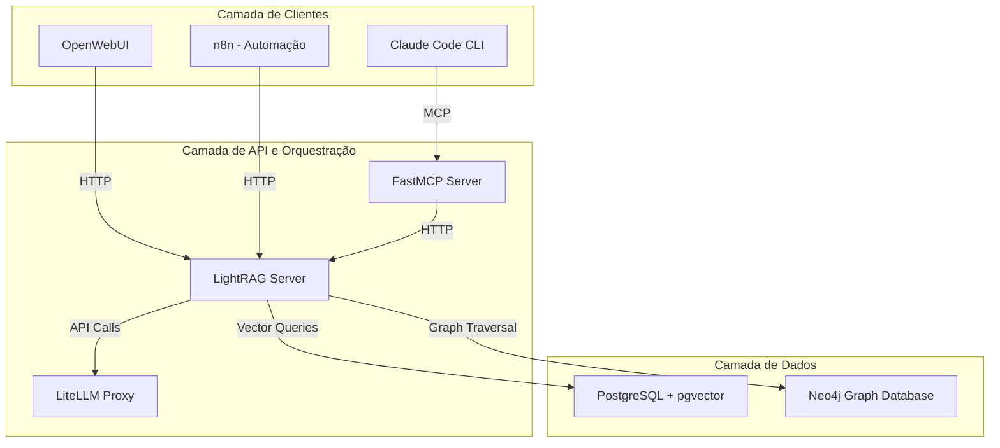
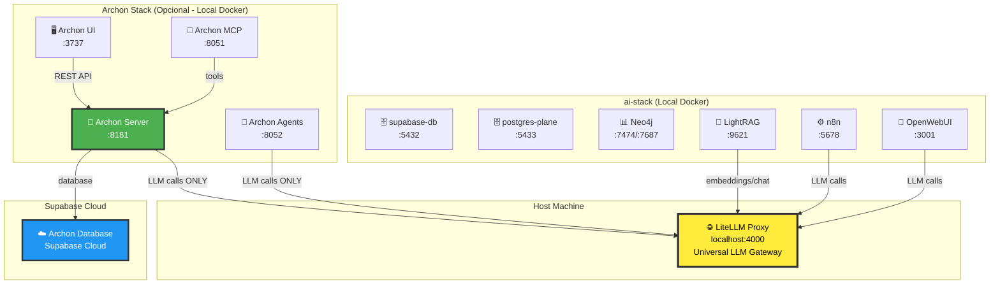

# 1. Architecture Overview

Status: alinhado com a Arquitetura Consolidada V4 (RAG + Supabase + Caddy) e gestão via Portainer.

Componentes e conexões:
- Supabase (db) inicializado primeiro por `start_services.py` com schema RAG
- RAG API exposto via Caddy em `RAG_HOSTNAME` (padrão `:8009`)
- Ingestão isolada por perfil `ingestion`
- Langfuse (observabilidade completa) e Redis/Valkey
- Portainer para gestão visual
- LiteLLM externo no host; serviços consulentes usam `LLM_BASE_URL`


> **📚 Documentação de Referência:**
> - [CLAUDE.md](../CLAUDE.md) - Guia completo de comandos e arquitetura
> - [📄CONTEXT.md](📄CONTEXT.md) - Visão geral do fluxo de dados e camadas
> - [🗄️DATABASE_SETUP.md](🗄️DATABASE_SETUP.md) - Estratégia dual-database detalhada

This guide details the construction of a production-grade, graph-enhanced RAG (Retrieval-Augmented Generation) system combining the efficiency of LightRAG with a **dual-database backend**: PostgreSQL for vector storage and Neo4j for graph operations.

## 1.0 Dual-Database Architecture (Critical Design Decision)

O ai-stack implementa uma **arquitetura dual-database** para separação de responsabilidades:

| Database | Porta | Superuser | Responsabilidade | Acesso |
| :--- | :---: | :--- | :--- | :--- |
| **supabase-db** | 5432 | supabase_admin | Core ai-stack (RAG, n8n, Supabase services) | `docker exec -it supabase-db psql -U supabase_admin -d postgres` |
| **postgres-plane** | 5433 | postgres | Plane project management (isolado) | `docker exec -it postgres-plane psql -U postgres -d plane_db` |

**Motivação da Arquitetura:**
- ✅ **Isolamento Total**: Plane requer configurações específicas que conflitam com Supabase
- ✅ **Zero Conflitos**: Usuários, roles e schemas completamente separados
- ✅ **Escalabilidade Independente**: Recursos dedicados por serviço
- ✅ **Upgrades Seguros**: Atualizar um banco sem afetar o outro
- ✅ **Backups Isolados**: Estratégias de recovery independentes

### 1.0.1 Componentes da Stack

| Component | Responsibility | Technology Stack |
| :--- | :--- | :--- |
| **Data Layer** | Stores vectors and manages relationships. | PostgreSQL (pgvector) + Neo4j |
| **RAG Engine** | Executes dual-level retrieval and ingestion. | LightRAG |
| **LLM Gateway** | Provides unified, centralized access to LLMs. | LiteLLM Proxy (Host:4000) |
| **Agent Interface** | Translates REST API calls into AI agent tools. | FastMCP Server (Model Context Protocol - MCP) |
| **User Interface** | Facilitates agentic interaction. | Claude Code CLI |
| **Project Management** | Optional AI-powered project orchestration | Archon (independent stack) |


## Key Components

- **Data Layer**: PostgreSQL (pgvector) + Neo4j (graph database)
- **RAG Engine**: LightRAG with dual-level retrieval (vector + graph)
- **Multimodal Processing**: RAG-Anything integration
- **LLM Gateway**: LiteLLM proxy for unified model access
- **Agent Interface**: MCP servers for AI tool integration
- **Development Framework**: BMAD methodology with Claude Code

**Critical Design Decision:** The graph database implementation targets **Neo4j** for production deployment.

The system flow involves the **Claude Code CLI** interacting via MCP with the **FastMCP Server**, which serves as an agentic bridge and handles memory augmentation. This server calls the **LightRAG Server** (the RAG orchestration layer), which uses the **LiteLLM Proxy** (LLM abstraction layer) to communicate with external LLMs, and ultimately retrieves data from the **PostgreSQL + Neo4j** Data Persistence Layer.


# 1. Arquitetura Expandida: Sistema RAG Multimodal com Grafos para Produção

## 1.1 Fundamentos Arquiteturais Unificados

### Estratégia de Framework Unificado
O sistema adota o LightRAG como framework central para recuperação híbrida (vetorial + grafos), complementado pelo RAG-Anything para processamento multimodal unificado. Esta abordagem elimina a complexidade de integrar múltiplas bibliotecas especializadas, proporcionando uma interface coesa para consulta de documentos com conteúdo multimodal intercalado.

### Backend Unificado PostgreSQL
PostgreSQL com extensões pgvector e Neo4j substitui uma stack distribuída de bancos especializados, reduzindo significativamente a complexidade operacional enquanto mantém consistência transacional ACID entre modelos de dados.

**Extensões Críticas:**
- **pgvector**: Busca de similaridade vetorial com algoritmos HNSW e IVFFlat
- **NEO4J**: Funcionalidade de banco de grafos.
- **Compatibilidade**: PostgreSQL 15-16 para suporte completo às extensões

### Gateway de Modelos Unificado
LiteLLM fornece abstração unificada para 100+ APIs de LLM, padronizando para formato OpenAI e permitindo troca de provedores via configuração.

## 1.2 Componentes e Fluxos de Dados Expandidos

### Pipeline de Ingestão Multimodal
```
Ingest → Parse → Chunk → Enrich → Index
```

**Estágio 1: Ingestão & Análise**
- **Parser de Alta Fidelidade**: MinerU/Docling para decomposição estrutural de PDF, DOCX, PPTX
- **Pré-processamento Padronizado**: Conversão de formatos simples (.txt, .md) para PDF temporário
- **Preservação de Hierarquia**: Manutenção da estrutura semântica original (parágrafos, seções, tabelas, imagens)

**Estágio 2: Fragmentação (Chunking)**
- **Texto**: Estratégias configuráveis (fixa, semântica LLM, recursiva hierárquica)
- **Tabelas**: Representação estruturada (Markdown/JSON) + resumo em linguagem natural
- **Imagens**: Metadados ricos via VLM (legenda, OCR, objetos, relações espaciais)

**Estágio 3: Enriquecimento & Extração de Conhecimento**
- **LLM Poderoso**: Modelos 32B+ parâmetros, contexto 64K tokens (Claude 3 Opus, Gemini 1.5 Pro)
- **Extração Estruturada**: Entidades e relacionamentos em schema JSON padronizado
- **Deduplicação**: Fusão de entidades/relacionamentos idênticos para otimização do grafo

**Estágio 4: Indexação**
- **Persistência Híbrida**: PostgreSQL (chunks vetoriais) + Neo4j (grafos de conhecimento)
- **Metadados Ricos**: Sumários, keywords, estratégia de chunking em JSONB

### Pipeline de Inferência Híbrida
```
Consulta → Pré-processamento → Recuperação Híbrida → Reranking → Síntese → Resposta
```

**Recuperação Dual-Level:**
- **Nível Local (Vetorial)**: Similaridade semântica em chunks específicos
- **Nível Global (Grafo)**: Travessia de relacionamentos para contextos amplos
- **Combinação Híbrida**: Resultados abrangentes com máximo contexto

## 1.3 Arquitetura de Plugin para Modalidades

### Interface BaseModalityHandler
```python
class BaseModalityHandler(ABC):
    @abstractmethod
    def can_handle(self, mimetype: str) -> bool:
        """Verifica suporte para tipo MIME"""
        pass
    
    @abstractmethod 
    def process(self, data: Any, metadata: Dict) -> List:
        """Processa dados da modalidade em chunks estruturados"""
        pass
```

**Handlers Especializados:**
- **TextHandler**: Texto plano e Markdown com estratégias de chunking
- **TableHandler**: Dados tabulares com representação estruturada + resumo
- **ImageHandler**: Processamento visual via VLM (legenda, OCR, detecção de objetos)
- **EquationHandler**: Equações LaTeX com validação e explicação

### Descoberta Dinâmica de Plugins
- Registro automático de handlers via scanning de diretório
- Roteamento inteligente baseado em tipo MIME
- Extensibilidade sem modificação do core do pipeline

## 1.4 Estratégia de Dados e Esquema Unificado

### Princípios de Design do Esquema
- **Granularidade**: Documentos, chunks e elementos de grafo como entidades interconectadas
- **Metadados Ricos**: JSONB para contexto, rastreabilidade e filtragem
- **Separação Lógica**: Tabelas dedicadas para KV, Vector, Graph, Status

### Esquema PostgreSQL Otimizado
```sql
-- Extensões essenciais
CREATE EXTENSION IF NOT EXISTS vector;
CREATE EXTENSION IF NOT EXISTS "uuid-ossp";

-- Tabela de documentos fonte
CREATE TABLE documents (
    id UUID PRIMARY KEY DEFAULT uuid_generate_v4(),
    doc_hash VARCHAR(64) UNIQUE NOT NULL, -- SHA-256 para idempotência
    source_uri TEXT NOT NULL,
    file_name TEXT,
    file_type VARCHAR(50),
    metadata JSONB,
    created_at TIMESTAMPTZ DEFAULT NOW()
);

-- Tabela de status de processamento  
CREATE TABLE doc_status (
    document_id UUID PRIMARY KEY REFERENCES documents(id),
    status doc_processing_status DEFAULT 'PENDING',
    last_error TEXT,
    updated_at TIMESTAMPTZ DEFAULT NOW()
);

-- Tabela de chunks (KV + Vector)
CREATE TABLE chunks (
    id UUID PRIMARY KEY DEFAULT uuid_generate_v4(),
    chunk_hash VARCHAR(64) UNIQUE NOT NULL,
    document_id UUID REFERENCES documents(id),
    chunk_order_index INT NOT NULL,
    content TEXT NOT NULL, -- Texto original para contexto LLM
    cleaned_content TEXT, -- Texto normalizado para embeddings
    embedding VECTOR(1536) NOT NULL, -- Dimensão fixa do modelo
    metadata JSONB,
    created_at TIMESTAMPTZ DEFAULT NOW()
);
```

## 1.5 Orquestração de Modelos e Configuração

### Abstração LiteLLM
```yaml
# config.yaml - Configuração como código
model_list:
  - model_name: "generation-model-default"
    litellm_params:
      model: "azure/gpt-4o-prod-deployment"
      api_key: "os.environ/AZURE_PROD_API_KEY"

  - model_name: "embedding-model-default"  
    litellm_params:
      model: "openai/text-embedding-3-large"
      api_key: "os.environ/OPENAI_API_KEY"
```

### Seleção Estratégica de Modelos
- **Indexação (Extração)**: LLMs poderosos (32B+, contexto 64K) para precisão
- **Consulta (Geração)**: Modelos com forte raciocínio e seguimento de instruções
- **Embeddings**: Modelos multilíngues de alta performance (BAAI bge-m3, OpenAI text-embedding-3-large)
- **Rerankers**: Modelos especializados (BAAI bge-reranker-v2-m3, Cohere) para precisão

### Gerenciamento de Contexto de API
```python
class RequestContextManager:
    def build_prompt(self, user_query: str, conversation_history: list, local_context: dict) -> list:
        """Constrói mensagens finais para API LLM com contexto recuperado"""
        retrieved_docs, retrieved_graph_data = self.db_retriever.hybrid_retrieve(user_query)
        formatted_context = self._format_retrieved_context(retrieved_docs, retrieved_graph_data)
        # ... construção do prompt aumentado
```

## 1.6 Implantação e Operações em Produção

### Containerização Otimizada
```dockerfile
# Build multi-estágio para imagens seguras e enxutas
FROM python:3.11-slim-bookworm AS builder
# ... instalação de dependências
FROM python:3.11-slim-bookworm
USER appuser  # Usuário não-root para segurança
COPY --from=builder /usr/local/lib/python3.11/site-packages /usr/local/lib/python3.11/site-packages
```

### Orquestração com Docker Compose
```yaml
services:
  database:
    image: postgres:16
    healthcheck:
      test: ["CMD-SHELL", "pg_isready -U postgres"]
      interval: 10s
      timeout: 5s
      retries: 5
  
  api:
    build: .
    depends_on:
      database:
        condition: service_healthy  # Espera saúde do banco
    deploy:
      resources:
        limits:
          cpus: '1.0'
          memory: 2G
```

### Segurança com Docker Secrets
- Credenciais via arquivos montados em `/run/secrets/`
- Variáveis `_FILE` para leitura segura (ex: `POSTGRES_PASSWORD_FILE`)
- Isolamento em filesystem in-memory (tmpfs)

## 1.7 Avaliação de Desempenho e Otimização

### Framework de Avaliação Data-Driven
**Dataset "Golden" Iterativo:**
- Início com 10-20 exemplos curados manualmente
- Geração semi-automática de tripletas (pergunta-resposta-contexto) via LLM
- Revisão humana-in-the-loop para qualidade
- Evolução contínua com casos de falha reais

### Métricas de Avaliação Abrangentes
| Categoria | Métrica | Método | Propósito |
|-----------|---------|--------|-----------|
| Recuperação | Context Precision@K | Proporção de documentos recuperados relevantes | Precisão do retriever |
| Recuperação | Context Recall@K | Proporção de documentos relevantes recuperados | Recall do retriever |
| Geração | Faithfulness | LLM-as-judge: suporte ao contexto | Prevenção de alucinações |
| Geração | Answer Relevance | LLM-as-judge: pertinência à pergunta | Qualidade da resposta |
| Geração | Answer Correctness | LLM-as-judge: comparação com ground truth | Precisão factual |

### Metodologia de Tuning Sistemático
**Hiperparâmetros Críticos:**
- Estratégia de chunking: `chunk_size`, `chunk_overlap`, método
- Modelo de embeddings: comparação de performance
- Parâmetros de recuperação: `top_k`, reranking
- Índices vetoriais: HNSW (`m`, `ef_construction`, `ef_search`)
- Templates de prompt: A/B testing para faithfulness

**Log Experimental Estruturado:**
| Experimento | Parâmetro | Valores | Métricas | Conclusões |
|-------------|-----------|---------|----------|------------|

### Dashboard de Monitoramento Contínuo
- Pipeline de avaliação automatizada (execução noturna)
- Plotagem temporal de métricas-chave
- Alertas para regressões de performance
- Validação de mudanças (código, modelos, dados)

---

---
## 1.4 Arquitetura Detalhada do Sistema Graph-RAG

### 1.4.1 Componentes Principais e Fluxo de Dados



### 1.4.2 Especificações Técnicas dos Componentes

#### LightRAG Server (Porta 9621)
- **Função**: Orquestração RAG e processamento multimodal
- **Recuperação Dual-Level**: 
  - **Low-Level**: Busca vetorial via PostgreSQL/pgvector
  - **High-Level**: Travessia de grafos via Neo4j
- **Modos de Operação**: `naive`, `local`, `global`, `hybrid` (recomendado)

#### PostgreSQL + pgvector
- **Extensões**: pgvector, uuid-ossp, full-text search
- **Esquema Otimizado**: 
  - Tabelas: `documents`, `doc_status`, `chunks`, `code_examples`
  - Índices HNSW para相似idade de cosseno
  - Hash SHA-256 para idempotência na ingestão

#### Neo4j Graph Database
- **Portas**: 7474 (Browser), 7687 (Bolt)
- **Esquema**: Entidades e relacionamentos com propriedades
- **Índices**: Otimizados para travessia de grafos e consultas Cypher

#### LiteLLM Proxy (Porta 4000)
- **Unificação**: 100+ modelos LLM via interface OpenAI
- **Gerenciamento Centralizado**: Chaves de API, retries, fallbacks
- **Modelos Suportados**: Claude, GPT-4, embeddings, modelos visuais

## 1.5 Fluxos de Trabalho de Ponta a Ponta

### 1.5.1 Consulta RAG via Agente MCP

1. **Prompt do Usuário** → Claude Code CLI
2. **Chamada MCP** → `query_knowledge_base` no FastMCP Server
3. **Contexto Persistente** → Leitura do Memory Bank (`project_brief.md`, `tech_stack.md`)
4. **API LightRAG** → `POST /query` com consulta aumentada
5. **Recuperação Híbrida**:
   - **Vetorial**: Similaridade semântica nos chunks do PostgreSQL
   - **Grafo**: Travessia de relacionamentos no Neo4j
6. **Síntese** → LLM gera resposta com contexto combinado
7. **Resposta Final** → Retorno através da cadeia MCP → Usuário

### 1.5.2 Ingestão de Documentos via n8n

1. **Trigger** → Novo arquivo no diretório `./memory-bank`
2. **Idempotência** → Cálculo de hash SHA-256 e verificação de duplicata
3. **API LightRAG** → `POST /documents/file` para processamento
4. **Pipeline Multimodal**:
   - **Análise**: Decomposição em texto, imagens, tabelas
   - **Enriquecimento**: 
     - Texto → Extração de entidades/relacionamentos
     - Imagens → Descrições via VLM (GPT-4o)
     - Tabelas → Resumos em linguagem natural
5. **Persistência Híbrida**:
   - **PostgreSQL**: Chunks vetorizados e metadados
   - **Neo4j**: Entidades e relacionamentos extraídos
6. **Atualização de Status** → Tabela `doc_status` marcada como `COMPLETED`

## 1.6 Estratégias de Otimização em Produção

### 1.6.1 Performance e Escalabilidade

```sql
-- Índices PostgreSQL para performance RAG
CREATE INDEX idx_chunks_embedding_hnsw ON chunks USING hnsw (embedding vector_cosine_ops);
CREATE INDEX idx_chunks_fts ON chunks USING GIN (fts_vector);
CREATE INDEX idx_documents_hash ON documents(doc_hash);

-- Configurações de performance no postgresql.conf
shared_buffers = '1GB'
work_mem = '256MB'
maintenance_work_mem = '512MB'
effective_cache_size = '4GB'
```

### 1.6.2 Monitoramento e Observabilidade

```python
# Métricas essenciais para sistema RAG em produção
rag_metrics = {
    'query_latency': 'Tempo de resposta das consultas',
    'retrieval_accuracy': 'Precisão na recuperação de contexto',
    'cache_hit_rate': 'Taxa de acerto do cache de embeddings',
    'token_usage': 'Uso de tokens por modelo LLM',
    'vector_similarity_threshold': 'Limiar de相似idade para resultados relevantes'
}
```

### 1.6.3 Segurança e Boas Práticas

- **Varredura Automática**: Integração Simgrip com 2.000+ regras de segurança
- **Revisão de Código**: Validação humana para código de infraestrutura
- **Gestão de Credenciais**: Centralização via LiteLLM Proxy
- **Containerização**: Isolamento de serviços via Docker

## 1.7 Benefícios da Arquitetura Unificada

### 1.7.1 Vantagens Operacionais
- **Redução de Complexidade**: PostgreSQL único vs múltiplos bancos especializados
- **Consistência Transacional**: Operações ACID entre dados vetoriais e de grafo
- **Performance Otimizada**: Consultas híbridas sem latência de rede entre sistemas
- **Manutenção Simplificada**: Backup, recovery e monitoramento unificados

### 1.7.2 Vantagens de Desenvolvimento
- **API Coesa**: Interface única para operações RAG complexas
- **Desacoplamento de Componentes**: Desenvolvimento independente por camada
- **Extensibilidade**: Adição fácil de novos modelos e provedores via LiteLLM
- **Ecosistema Rico**: Integração com ferramentas MCP existentes

---
*Nota: Este conteúdo deve ser concatenado ao arquivo alvo identificado*
---

#### **4.1 Novo Diagrama Arquitetural: Multi-Agent Orchestration**

```mermaid
graph TB
    subgraph "Camada de Clientes & Terminais"
        A["🖥️ Claude Code<br/>(Local Dev)"]
        B["⌨️ GitHub Copilot CLI<br/>(Terminal Agent)"]
        C["🌐 OpenWebUI<br/>(Web Interface)"]
    end
    
    subgraph "Camada de Orquestração & Agência (NOVO)"
        D["🎛️ Mission Control<br/>(Agent HQ)"]
        E["🔀 Agent Router<br/>(LiteLLM Enhanced)"]
        F["📋 n8n Orchestrator<br/>(GitHub ↔ Plane)"]
    end
    
    subgraph "Camada MCP & Ferramentas"
        G["🔗 FastMCP Server"]
        H["🔗 GitHub MCP Server"]
        I["🔗 Plane MCP Server"]
        J["🔗 Custom MCP Servers"]
    end
    
    subgraph "Camada de Recuperação & Síntese"
        K["🧠 LightRAG Server<br/>(RAG Hybrid)"]
        L["🎯 LiteLLM Proxy<br/>(Model Gateway)"]
    end
    
    subgraph "Camada de Persistência"
        M["🗄️ PostgreSQL<br/>(Vectors + pgvector)"]
        N["📊 Neo4j<br/>(Knowledge Graphs)"]
    end
    
    A -->|MCP Calls| G
    B -->|MCP Calls| H
    C -->|REST| K
    
    D -->|Route Tasks| E
    E -->|Selects Model| L
    F -->|Webhook Events| D
    
    G ←→ E
    H ←→ D
    I ←→ F
    J ←→ E
    
    K ←→ M
    K ←→ N
    L ←→ M
    
    style D fill:#ffeb3b,stroke:#333,stroke-width:3px,color:#000
    style B fill:#00bcd4,stroke:#333,stroke-width:3px,color:#fff
    style E fill:#ff9800,stroke:#333,stroke-width:3px,color:#fff
```

#### **4.2 Governança de Segurança: Camada Agent HQ**

```yaml
# .github/agent-security-policy.yml

agent_security_framework:
  
  authentication:
    - github_app_verification: true
    - mcp_server_validation: true
    - rate_limiting: "1000 req/min per agent"
  
  authorization:
    - branch_restrictions:
        main: "only-approved-agents"
        develop: "all-agents"
        feature/*: "all-agents"
    
    - file_restrictions:
        - pattern: "src/security/**"
          allowed_agents: ["senior-developer-agent"]
          requires_approval: true
        - pattern: "config/secrets/**"
          allowed_agents: []
          requires_approval: true
    
    - action_restrictions:
        deploy:
          allowed_agents: ["deployment-agent"]
          requires_approval: true
          approval_type: "human-only"
        
        delete_database:
          allowed_agents: []
          requires_approval: true
          approval_type: "2-factor-human"

  audit_logging:
    enabled: true
    destination: "cloudwatch"
    retention: "90 days"
    events:
      - "agent_execution_start"
      - "agent_execution_end"
      - "file_modification"
      - "approval_request"
      - "security_incident"

  incident_response:
    auto_rollback: true
    rollback_window: "1 hour"
    notification_channels: ["slack", "email", "pagerduty"]
    escalation_threshold:
      failure_rate: "20%"
      error_type: "security"
```

---

## 2. Integração Opcional: Archon Project Management

### 2.1 Arquitetura de Integração Archon

O **Archon** é um sistema modular de gerenciamento de projetos com IA que pode ser integrado opcionalmente ao ai-stack. Ele roda como uma **stack completamente independente** e se comunica com o ai-stack **apenas via LiteLLM Proxy**.



### 2.2 Decisões Arquiteturais: Archon

| Aspecto | Decisão | Justificativa |
|---------|---------|---------------|
| **Database** | Supabase Cloud (separado) | ✅ Isolamento total do ai-stack<br/>✅ Sem conflitos de porta/schema<br/>✅ Backups gerenciados |
| **Comunicação LLM** | Apenas via LiteLLM Proxy (4000) | ✅ Ponto único de integração<br/>✅ Sem dependências diretas<br/>✅ Reutilização de API keys |
| **Rede** | Stacks Docker independentes | ✅ Desacoplamento completo<br/>✅ Pode rodar/parar independentemente<br/>✅ Sem shared networks |
| **Portas** | Range 3737-8181 (sem conflitos) | ✅ Não sobrepõe portas do ai-stack<br/>✅ Fácil identificação |

### 2.3 Serviços Archon

| Serviço | Porta | Função | Database |
|---------|-------|--------|----------|
| **Archon UI** | 3737 | Interface web React | Supabase Cloud (via Server) |
| **Archon Server** | 8181 | Backend FastAPI (CRUD, logic) | Supabase Cloud |
| **Archon MCP** | 8051 | MCP server for Claude Code tools | Supabase Cloud (via Server) |
| **Archon Agents** | 8052 | AI agent runtime (crawlers, analyzers) | Supabase Cloud (via Server) |

### 2.4 Quando Usar Archon?

**Use Archon se você precisa de:**
- ✅ Gerenciamento avançado de projetos com IA
- ✅ Web crawling automático para análise de documentação
- ✅ Extração automática de exemplos de código de repositórios
- ✅ Integração GitHub → Tarefas com análise de IA
- ✅ MCP tools adicionais para Claude Code (`archon:rag_search_knowledge_base`, `archon:manage_project`, etc.)

**NÃO use Archon se:**
- ❌ Você só precisa de RAG básico (use LightRAG diretamente)
- ❌ Plane já atende suas necessidades de PM
- ❌ Você quer minimizar complexidade (Archon adiciona 4 serviços)

### 2.5 Configuração Archon (.env)

```bash
# /home/sedinha/ai-stack/Archon/.env

# ⚠️ IMPORTANTE: Usar Supabase Cloud, NÃO supabase-db local!
SUPABASE_URL=https://seu-projeto.supabase.co
SUPABASE_SERVICE_KEY=eyJhbGci... # Service role key do Cloud

# ✅ CRÍTICO: Redirecionar LLM para LiteLLM Proxy do ai-stack
OPENAI_BASE_URL=http://host.docker.internal:4000/v1
OPENAI_API_KEY=sk-auto-headers-2025  # Usar LITELLM_MASTER_KEY do ai-stack

# Portas (evitar conflitos com ai-stack)
ARCHON_UI_PORT=3737
ARCHON_SERVER_PORT=8181
ARCHON_MCP_PORT=8051
ARCHON_AGENTS_PORT=8052
```

### 2.6 Comandos Archon

```bash
# Iniciar Archon (após ai-stack e LiteLLM estarem rodando)
cd /home/sedinha/ai-stack/Archon
docker compose up -d

# Ver logs
docker compose logs -f archon-server
docker compose logs -f archon-agents

# Verificar saúde
curl http://localhost:8181/health
curl http://localhost:3737  # UI

# Parar Archon (não afeta ai-stack)
docker compose down
```

### 2.7 MCP Tools Archon para Claude Code

Quando Archon está rodando, você pode usar estas ferramentas no Claude Code:

```json
// ~/.config/claude-code/mcp.json
{
  "mcpServers": {
    "archon": {
      "url": "http://localhost:8051"
    }
  }
}
```

**Ferramentas disponíveis:**
- `archon:rag_search_knowledge_base` - Buscar na base de conhecimento do Archon
- `archon:find_projects` - Listar projetos
- `archon:manage_project` - Criar/atualizar/deletar projetos
- `archon:find_tasks` - Listar tarefas
- `archon:manage_task` - Criar/atualizar/deletar tarefas

### 2.8 Fluxo de Dados: ai-stack + Archon

```
┌────────────────────────────────────────────────┐
│         Claude Code (Local Development)        │
└───┬────────────────────────────────────────┬───┘
    │                                        │
    │ MCP: rag_search                        │ MCP: archon:manage_project
    │                                        │
┌───▼────────────────┐              ┌────────▼──────────────┐
│  FastMCP Server    │              │  Archon MCP Server    │
│  (ai-stack)        │              │  (Archon)             │
└───┬────────────────┘              └────────┬──────────────┘
    │                                        │
    │ HTTP: /query                           │ HTTP: /api/projects
    │                                        │
┌───▼────────────────┐              ┌────────▼──────────────┐
│  LightRAG Server   │              │  Archon Server        │
│  :9621             │              │  :8181                │
└───┬───────┬────────┘              └────────┬──────────────┘
    │       │                                │
    │       │                                │
    │       │      ┌─────────────────────────┘
    │       │      │
    │       │      │ LLM requests (embeddings, chat)
    │       │      │
┌───▼──┐ ┌──▼──┐ ┌▼─────────────────────────────────┐
│ PG   │ │Neo4j│ │  LiteLLM Proxy (Host:4000)       │
│:5432 │ │:7474│ │  ⚡ Single point of integration  │
└──────┘ └─────┘ └──────────────────────────────────┘
                          │
                          │ OpenAI/Anthropic/GitHub APIs
                          │
                  ┌───────▼──────────┐
                  │  External LLMs   │
                  │  (Claude, GPT-4) │
                  └──────────────────┘
```

**Ponto-chave:** Archon e ai-stack se comunicam **apenas via LiteLLM Proxy** (porta 4000). Não há conexões diretas entre bancos de dados ou serviços.

---

**📝 Documentação Relacionada:**
- [ARCHON_INTEGRATION.md](../docs/ARCHON_INTEGRATION.md) - Setup passo-a-passo do Archon
- [ARCHON_VALIDATION.md](../docs/ARCHON_VALIDATION.md) - Scripts de validação
- [Resolvendo Problemas do Archon no Arch Linux](../docs/Resolvendo%20o%20Problema%20do%20Archon%20no%20Arch%20Linux.md) - Troubleshooting

**📅 Última Atualização:** 2025-01-28
